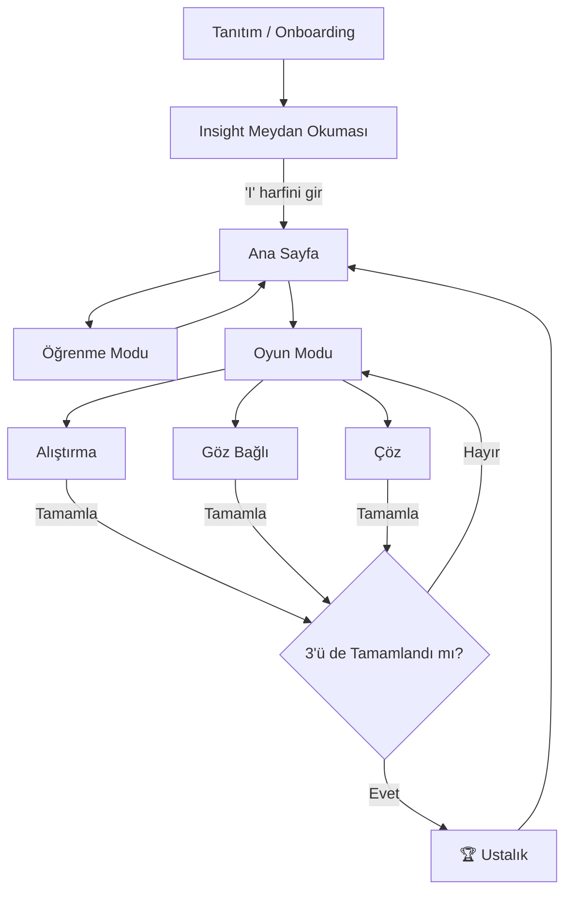

<h1 align="center">Insight</h1>

<p align="center">
  <strong>Braille'i Dokunarak, Duyarak ve Hissederek Deneyimle</strong>
</p>

<p align="center">
  <strong>🇹🇷 Türkçe</strong> · <a href="README_EN.md">🇬🇧 English</a>
</p>

<p align="center">
  
  
  
  
</p>

---

## 🌟 Hakkında

**Insight**, görme engelli bireylerin dünyasına empati ve anlayış katmak için tasarlanmış interaktif bir Braille deneyimleme uygulamasıdır. Braille karakterlerini sadece ekranda göstermek yerine, Insight onları *hissetmenizi* sağlar — özenle tasarlanmış haptik titreşim desenleri, ses geri bildirimleri ve çoklu duyusal bir yaklaşımla Braille'in dokunsal dünyasını canlı kılar.

Bu uygulama kapsamlı bir Braille eğitimi sunmayı amaçlamaz; gerçek Braille alfabesi, çeşitli diller, sayılar, noktalama işaretleri ve kısaltmalarıyla çok daha geniş bir sistemdir. **Insight**, bu zengin dünyanın kapısını aralayarak kullanıcıya Braille'i dokunarak keşfetme fırsatı sunar.

> *"Dünya genelinde 285 milyon insan görme bozukluğuyla yaşıyor. Ancak dokunma için tasarlanmış bir dil var."*

---

## ✨ Özellikler

### 📖 İnteraktif Tanıtım
Sahneyi kuran güzel animasyonlu bir giriş — görme engeline dair gerçek istatistikleri sunarak, Braille tarihini tanıtarak ve kullanıcıyı uygulamalı bir deneyime davet ederek başlar.

### 🔤 Keşfet Modu
Braille alfabesinin temel **26 harfini** interaktif bir kart ile keşfedin. Her harf, nokta desenini gösterirken **"Deseni Hisset"** butonu, noktaları Braille okuma sırasına göre (sol sütun → sağ sütun) tarayan senkronize bir haptik + ses geri bildirimi başlatır.

### 🎮 Üç Oyun Modu

| Mod | Açıklama |
|-----|----------|
| **Practice (Alıştırma)** | Nokta desenini gör, haptiği hisset ve çoktan seçmeli şıklardan doğru harfi bul |
| **Blindfold (Göz Bağlı)** | Ekran karanlığa bürünür — sürükleyerek hissettiğin interaktif Braille hücresiyle sadece dokunarak ilerle |
| **Decipher (Çöz)** | Braille desenlerini tek tek harflerle eşleştir, ardından harfleri birleştirerek kelime oluştur |

### 🏆 Ustalık Sistemi
Üç oyun modunu da tamamlayarak **Ustalık** kutlama ekranını açın — ilham verici istatistikler ve Braille deneyim yolculuğunuz üzerine bir düşünce.

### ♿ Tam Erişilebilirlik
- Her interaktif öğede özel **VoiceOver** etiketleri ve ipuçları
- `UIAccessibility.post` ile **ekran değişikliği duyuruları**
- **Hareketi Azalt** desteği — tüm animasyonlar `accessibilityReduceMotion` ayarına uyar
- Anlamsal erişilebilirlik özellikleri (`.isButton`, `.combine`, `.contain`)

---

## 🛠 Kullanılan Teknolojiler

| Teknoloji | Kullanım |
|-----------|----------|
| **SwiftUI** | Özel bileşenler, animasyonlar ve uyarlanabilir yerleşimler için `GeometryReader` ile tamamen bildirimsel (declarative) UI |
| **CoreHaptics** | `CHHapticEngine` ile zengin, desenli haptik geri bildirim — nokta geçişleri, Braille deseni tarama, başarı/hata geri bildirimi, dokunma keşfi için sürekli titreşim |
| **AVFoundation** | Özel `.wav` ses efektleri için `AVAudioPlayer`; UI geri bildirimi için `AudioToolbox` sistem sesleri |
| **Erişilebilirlik** | VoiceOver öncelikli tasarım, ekran değişikliği duyuruları, Hareketi Azalt uyumluluğu ve anlamsal etiketleme |

---

## 🏗 Mimari

```
Insight/
├── App/
│   └── InsightApp.swift            # Uygulama giriş noktası
├── Models/
│   ├── BrailleData.swift           # A-Z Braille nokta eşlemeleri
│   ├── WordData.swift              # Kelime oyunu verileri
│   └── GameConstants.swift         # Oyun yapılandırması
├── ViewModels/
│   ├── BrailleViewModel.swift      # Harf navigasyonu ve quiz mantığı

│   └── WordsGameViewModel.swift    # Kelime oyunu mantığı
├── Managers/
│   ├── NavigationManager.swift     # Rota yönetimi ve tamamlanma takibi
│   ├── HapticManager.swift         # CoreHaptics motoru ve desenleri

│   ├── SoundManager.swift          # Ses geri bildirimi (sistem + özel)
│   └── GameFlowManager.swift       # Paylaşılan oyun akışı araçları
├── Views/
│   ├── MainViews/
│   │   ├── HomeView.swift          # Ana menü
│   │   ├── LearnView.swift         # Braille alfabe gezgini
│   │   └── GameModeView.swift      # Oyun modu seçici
│   ├── GameViews/
│   │   ├── PracticeGameView.swift  # Alıştırma quizi
│   │   ├── BlindfoldGameView.swift # Karanlık dokunmatik oyun
│   │   └── WordsGameView.swift     # Kelime çözme oyunu
│   └── Components/
│       ├── Shared/                 # Ortak UI (BrailleDot, GameEndView, TopBar)
│       ├── Game/                   # Oyun bileşenleri (DarkBrailleTouchCell, AnswerOptions)
│       └── Words/                  # Kelime oyunu bileşenleri (LockedBrailleCard, PatternOptions)
├── Resources/
│   ├── AppColors.swift             # Merkezi renk paleti
│   └── Assets.xcassets             # Uygulama ikonu ve renk varlıkları
├── RootView.swift                  # Rota tabanlı görünüm değişimi
├── IntroView.swift                 # Tanıtım deneyimi
├── InsightChallengeView.swift      # "I harfini gir" karanlık meydan okuma
└── MasteryView.swift               # Tamamlama kutlaması
```

---

## 📱 Kullanıcı Akışı



---

## 🎯 WWDC Öne Çıkanlar

- **Çoklu Duyusal Deneyim** — Görsel, haptik ve ses kanallarını birleştirerek Braille'in dokunsal dünyasını dijital ortamda hissettir
- **Empati Odaklı Tasarım** — Göz Bağlı modu görsel ipuçlarını ortadan kaldırarak yalnızca dokunarak yön bulmaya bir bakış sunar
- **CoreHaptics Ustalığı** — Özel `CHHapticEvent` desenleri, hassas zamanlama ile Braille noktalarını okuma sırasıyla tarar
- **Evrensel Yerleşim** — iPhone ve iPad arasında, dikey ve yatay yönlerde sorunsuz uyum sağlayan duyarlı tasarım
- **Erişilebilirlik Öncelikli** — Sonradan eklenmedi — VoiceOver desteği, Hareketi Azalt uyumluluğu ve ekran değişikliği duyuruları her görünüme entegre edildi

---

## 📋 Gereksinimler

- **Xcode** 16.0+
- **iOS / iPadOS** 17.0+
- Tam deneyim için **Haptik Motora sahip cihaz** önerilir

---

## 🏷️ Orijinal WWDC26 Başvurusu

Bu proje başlangıçta **WWDC26 Swift Student Challenge** için geliştirilmiştir.
Orijinal başvuru haline buradan ulaşabilirsiniz:

👉 [`wwdc26-submission`](../../releases/tag/wwdc26-submission)

---

## 📄 Lisans

Bu proje **WWDC26 Swift Student Challenge** başvurusu olarak oluşturulmuştur.

---

<p align="center">
  ❤️ ile yapıldı — <strong>Atakan</strong>
</p>
