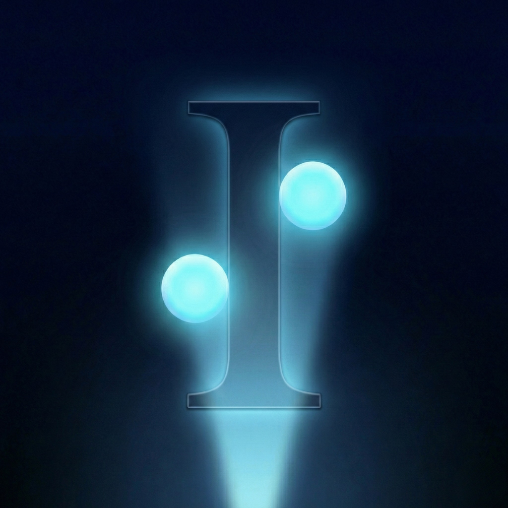
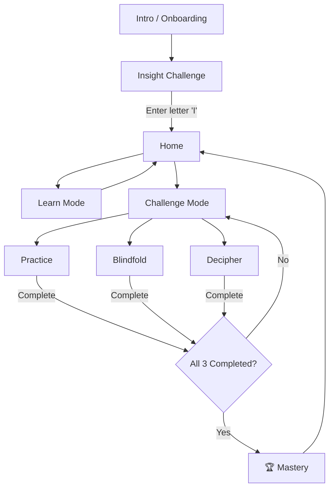

<p align="center">
  
</p>

<h1 align="center">Insight</h1>

<p align="center">
  <strong>Experience Braille Through Touch, Sound & Haptics</strong>
</p>

<p align="center">
  <a href="README.md">🇹🇷 Türkçe</a> · <strong>🇬🇧 English</strong>
</p>

<p align="center">
  
  
  
  
</p>

---

## 🌟 About

**Insight** is an interactive Braille experience designed to build empathy and understanding for the visually impaired community. Rather than simply displaying Braille characters on screen, Insight lets you *feel* them — through carefully designed haptic patterns, audio feedback, and a multi-sensory approach that brings the tactile world of Braille to life.

This app is not intended to be a comprehensive Braille course; real Braille spans multiple languages, numbers, punctuation, and contractions — a far richer system than 26 letters alone. **Insight** opens the door to that world, giving you a hands-on glimpse into what it means to read through touch.

> *"285 million people worldwide live with visual impairments. But there is a language designed for touch."*

---

## ✨ Features

### 📖 Interactive Onboarding
A beautifully animated intro that sets the stage — presenting real-world statistics about visual impairment, introducing Braille history, and inviting the user into a hands-on experience.

### 🔤 Explore Mode
Browse through the basic **26 letters** of the Braille alphabet with an interactive card. Each letter displays its dot pattern while a **"Feel the Pattern"** button triggers a synchronized haptic + audio playback that scans the dots in Braille reading order (left column → right column).

### 🎮 Three Challenge Modes

| Mode | Description |
|------|-------------|
| **Practice** | See the dot pattern, feel the haptic, and pick the correct letter from multiple choices |
| **Blindfold** | The screen goes dark — navigate by touch alone using an interactive drag-to-feel Braille cell |
| **Decipher** | Match Braille patterns to individual letters, then assemble them into complete words |

### 🏆 Mastery System
Complete all three challenge modes to unlock the **Mastery** celebration view with inspiring statistics and a reflection on your Braille experience journey.

### ♿ Full Accessibility
- Custom **VoiceOver** labels and hints on every interactive element
- **Screen change announcements** via `UIAccessibility.post`
- **Reduce Motion** support — all animations respect `accessibilityReduceMotion`
- Semantic accessibility traits (`.isButton`, `.combine`, `.contain`)

---

## 🛠 Technologies

| Technology | Usage |
|------------|-------|
| **SwiftUI** | Entire UI built declaratively with custom components, animations, and `GeometryReader` for adaptive layouts |
| **CoreHaptics** | `CHHapticEngine` for rich, patterned haptic feedback — dot toggles, Braille pattern scanning, success/error feedback, continuous buzz for touch exploration |
| **AVFoundation** | `AVAudioPlayer` for custom `.wav` sound effects; `AudioToolbox` system sounds for UI feedback |
| **Accessibility** | VoiceOver-first design with screen change announcements, Reduce Motion support, and semantic labeling |

---

## 🏗 Architecture

```
Insight/
├── App/
│   └── InsightApp.swift            # App entry point
├── Models/
│   ├── BrailleData.swift           # A-Z Braille dot mappings
│   ├── WordData.swift              # Word game data
│   └── GameConstants.swift         # Game configuration
├── ViewModels/
│   ├── BrailleViewModel.swift      # Letter navigation & quiz logic
│   └── WordsGameViewModel.swift    # Word game logic
├── Managers/
│   ├── NavigationManager.swift     # Route management & game completion tracking
│   ├── HapticManager.swift         # CoreHaptics engine & patterns
│   ├── SoundManager.swift          # Audio feedback (system + custom)
│   └── GameFlowManager.swift       # Shared game flow utilities
├── Views/
│   ├── MainViews/
│   │   ├── HomeView.swift          # Main menu
│   │   ├── LearnView.swift         # Braille alphabet explorer
│   │   └── GameModeView.swift      # Challenge mode selector
│   ├── GameViews/
│   │   ├── PracticeGameView.swift  # Practice quiz
│   │   ├── BlindfoldGameView.swift # Dark touch-based game
│   │   └── WordsGameView.swift     # Word deciphering game
│   └── Components/
│       ├── Shared/                 # Reusable UI (BrailleDot, GameEndView, TopBar)
│       ├── Game/                   # Game-specific (DarkBrailleTouchCell, AnswerOptions)
│       └── Words/                  # Word game components (LockedBrailleCard, PatternOptions)
├── Resources/
│   ├── AppColors.swift             # Centralized color palette
│   └── Assets.xcassets             # App icon & color assets
├── RootView.swift                  # Route-based view switching
├── IntroView.swift                 # Onboarding experience
├── InsightChallengeView.swift      # "Enter letter I" dark challenge
└── MasteryView.swift               # Completion celebration
```

---

## 📱 User Flow



---

## 🎯 WWDC Highlights

- **Multi-Sensory Experience** — Combines visual, haptic, and audio channels to let you feel Braille in a way that simulates real tactile reading
- **Empathy-Driven Design** — The Blindfold mode strips away visual cues, offering a glimpse into navigation through touch alone
- **CoreHaptics Mastery** — Custom `CHHapticEvent` patterns scan Braille dots in reading order with precisely timed transient and continuous haptic events
- **Universal Layout** — Responsive design adapts seamlessly between iPhone and iPad, portrait and landscape orientations
- **Accessibility First** — Not an afterthought — VoiceOver support, Reduce Motion compliance, and screen change announcements are built into every view

---

## 📋 Requirements

- **Xcode** 16.0+
- **iOS / iPadOS** 17.0+
- **Device with Haptic Engine** recommended for the full experience

---

## 🏷️ Original WWDC26 Submission

This project was originally developed for the **WWDC26 Swift Student Challenge**.
You can view the original submission version here:

👉 [`wwdc26-submission`](../../releases/tag/wwdc26-submission)

---

## 📄 License

This project was created as a submission for the **WWDC26 Swift Student Challenge**.

---

<p align="center">
  Made with ❤️ by <strong>Atakan</strong>
</p>
